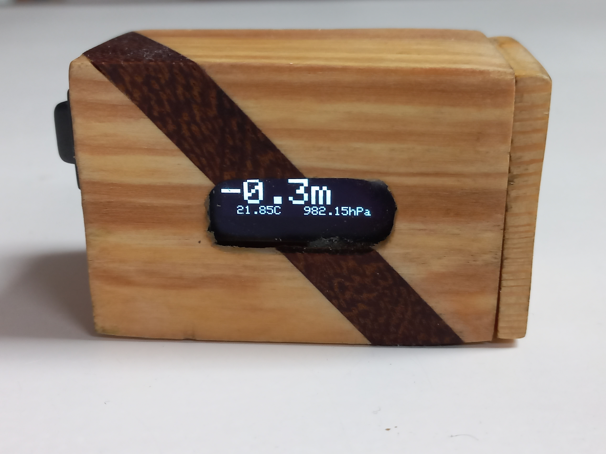
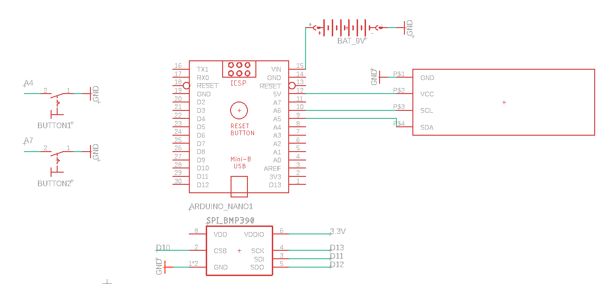

# Arduino wysokosciomierz
## Opis
Ten projekt wykorzystuje Arduino Nano do odczytu danych z czujnika ciśnienia i temperatury (BMP390) oraz wyświetlania tych informacji na ekranie OLED. Urządzenie wymaga wprowadzenia aktualnej wysokości n.p.m. przed każdym uruchomieniem. Za pomocą dwóch przycisków użytkownik ustawia aktualną wysokość, a następnie, zatwierdzając wartość, program przełącza się w tryb odczytu aktualnej wysokości, ciśnienia i temperatury. Możliwe jest również włączenie trybu oszczędzania energii, podczas którego ekran jest wygaszony, czujnik nie zbiera informacji, a mikrokontroler czeka na sygnał wybudzenia  z przycisków.
## wykonanie
Arduino zasilane jest 9V baterią z możliwością wymiany. Całość zamknięta jest we własnorecznie wykonenej obudowie z drewna. Z tyłu znajduje się klapka na magnesy, a po drugiej stronie wyłącznuk zasilania
### prezentacja

## schemat elektryczny

